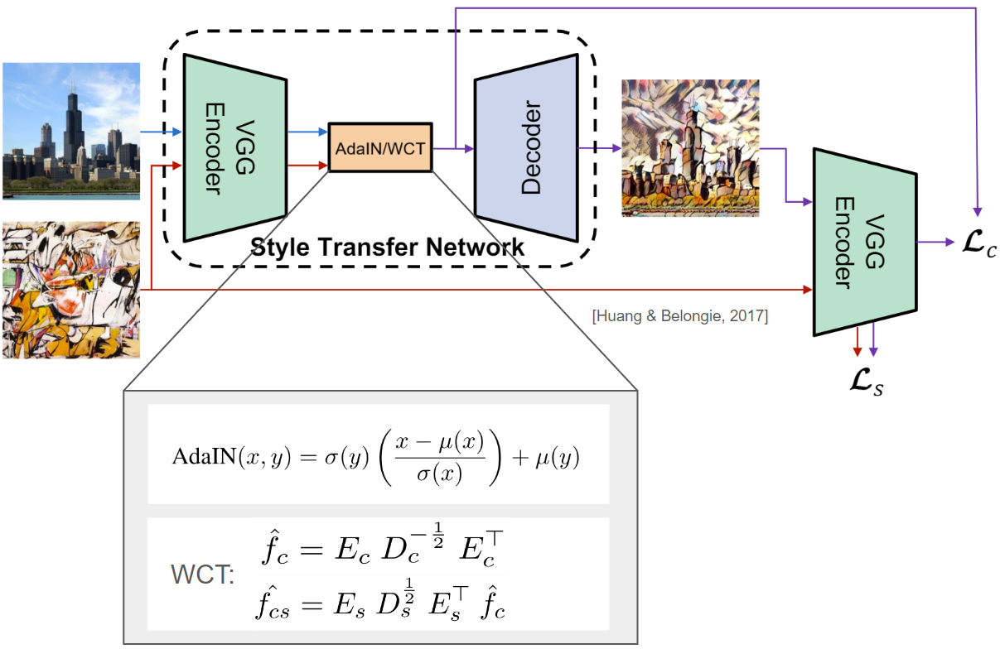
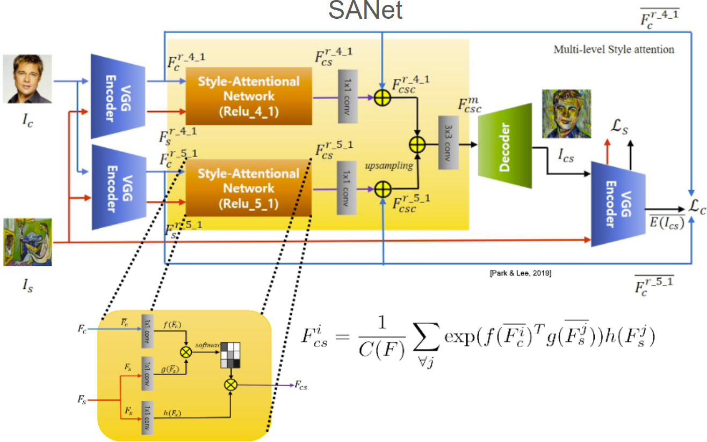

## Introduction

Conventional deep neural network models implemented for object detection in images tend to demonstrate subpar performance when it comes to art, especially in paintings and drawings. Because most object detection models are trained on large datasets of photographs and have been optimized to recognize an object by its texture rather than shape, the problem of object recognition in art arises from the unique styles and distortions made by brush strokes and manually drawn lines. To improve object detection, we have fine-tuned neural network models on stylized images generated by applying state-of-the-art style transfer techniques to existing datasets. Such modifications would help better align the two domains, improving object detection performance in art.

## Motivation

In tandem with the sweeping advances made in the field of object detection over the past decade, the demand to expand its use beyond photographs has also grown. In the realm of art, for instance, art museums have started using computer vision to help categorize or annotate the vast number of pieces in their collections in order to ease the burden of doing so by hand. 
We could fine-tune a neural network, but there are not enough datasets of labeled artwork. Kadish et al. (2021) suggest using style transfer on labeled photographs to generate labeled art. Hence, to contribute to this development, we aim to re-implement the research (Kadish et al., 2021), in which the authors employed an art style transfer technique on an already existing and labeled dataset of photographs to then fine-tune a neural network to better identify people in real artwork. 
Since the development of the dataset in (Kadish et al., 2021), it was found that style transfer models suffer from what (An et al., 2021) term as “content leak”. Through repeated rounds of styling an input image based on a reference image, the content from the reference image begins to appear in the stylized input image. Modern style transfer models attempt to solve the issue of content leak. 
Finally, we also generate alternative training sets with improved style transfer models, Whitening and Color Transforms (WCT) and SANet, and compare results of people detection with baseline AdaIN.

## Style transfer data

For content images we pull from the COCO 2017 dataset (Lin et. al. 2014) which consists of labeled photographs of various objects and people. We use the API to filter only on photos that contain people, which leaves us with ~64k images to create a training set and ~3k images to create a validation set for our downstream classification.

For style images we pull from the Painter-by-Numbers dataset (Saleh & Elgammal 2015), which consists of ~72k scans of actual paintings spanning dozens of artistic movements. 

For inference, we pair each content image with a random style image. These pairs are consistent across models in order to accurately compare the results of people detection.

## Style transfer demo

A few examples are included in the GitHub repository to facilitate running style transfer with all 3 models to generate the training examples for people detection.

**Preliminaries**

First make sure to `pip install -r requirements.txt`. Next, install the pre-trained weights for the various models [here](https://drive.google.com/drive/folders/1QVw2h3XUGjWaLZkFttwSCEjWR_EbtKZ9?usp=drive_link).

1. Within each `ArtFlow-X` folder is a `glow.pth`. Place each in the corresponding folder located in `ArtCV-Object-Detection-in-Artistic-Images/models/stylize/ArtFlow/experiments`.
2. Move the _contents_ of the `SANet` folder into `ArtCV-Object-Detection-in-Artistic-Images/models/stylize/SANet` (do not move entire folder).

**Inference with AdaIN/WCT**

Starting from the parent directory of the repository, `cd` to `models/stylize/ArtFlow` and run the following commmands.

For AdaIN:

`python3 test.py --content_dir ../../../data/examples/content --style_dir ../../../data/examples/style --decoder experiments/ArtFlow-AdaIN/glow.pth --output ../../../output/styled_images/examples/ArtFlow-AdaIn --operator adain --size 0 &`

For WCT:

`python3 test.py --content_dir ../../../data/examples/content --style_dir ../../../data/examples/style --decoder experiments/ArtFlow-WCT/glow.pth --output ../../../output/styled_images/examples/ArtFlow-WCT --operator wct --size 0 &`

**Inference with SANet**

Starting from the parent directory of the repository, `cd` to `models/stylize/SANet` and run the following commmand:

`python3 inference.py --content_dir ../../../data/examples/content --style_dir ../../../data/examples/style --vgg vgg_normalised.pth --output ../../../output/styled_images/examples/SANet --start_iter 500000 --size 0 &`

## Style transfer methodology

We built upon the work of Kadish et. al. (2021) by considering two alternative--and potentially improved--style transfer techniques to Adaptive Instance Normalization (AdaIN): Whitening and Coloring Transforms and Style-Attention Network. Using these two models, we will generate competing synthetic training sets for person detection and compare their accuracy relative to the baseline model trained with AdaIN-generated stylized photos.

### Whitening and color transforms (WCT)

WCT (Huang & Belongie, 2017) and AdaIN share a similar architecture (see diagram below). Both consist of a pre-trained VGG-19 encoder which maps the input content and style images into a high-dimensional feature space. Then, certain feature layers are linearly transformed and passed through the decoder which is learned in model training. The output of the decoder is the stylized content image.

Before contrasting the models, a quick note on the taxonomy of the feature space. The feature space consists of feature layers, where each layer may consist of multiple channels. Earlier feature layers tend to capture semantic patterns in a mapped image, whereas deeper layers will capture more localized patterns.

The models differ in the linear transformation that is applied to feature layers after encoding. For a given feature layer, AdaIN matches the channel-wise mean and variance of the content and style images by shifting and scaling the feature layer of the content image accordingly. WCT intends to perform a similar but improved operation. Instead of considering just channel-wise relationships, WCT incorporates inter-channel relationships by applying a two-fold linear transformation. First, a whitening transformation is applied to the content image's feature layer to attempt to strip the image of its stylistic properties. Next, a coloring transformation (which is a function of the style image's feature layer) is applied to the whitened content image feature layer to attempt to apply the styistic properties of the style image to the content image. Note that $f_{c}$ is a matrix of channels of the feature layer of the content image $c$ (i.e., $f_{c} \in \mathbb{R}^{C \times (h*w)}$, where $C$ is the number of channels and $h$ and $w$ are the height and width of the content image, respectively). Also note that the transformation matrix is (roughly) the eigendecomposition of $f_{c}f_{c}^{T}$, which when normalized is the covariance matrix of $f_{c}$. This further explains the notion that WCT is accounting for cross-channel relationships.

### Style-attention network (SANet)

The second model we experiment with is SANet (Park & Lee 2019).

The model broadly shares the same structure as AdaIN and WCT (see diagram above). The content and style images are mapped to the feature space with a pre-trained VGG-19 encoder. Select feature layers are transformed, upsampled and concatenated to then be sent through a learned decoder, which takes the input and produces the stylized content image.

Where SANet differs from the other two models is in the transform stage. Unlike WCT and AdaIN, SANet performs a nonlinear transformation of the feature layers. Specifically, the authors incorporate an attention mechanism to capture not just inter-channel relationships within a single feature layer, but inter-layer relationships across the feature space. The motivation behind this choice is that each feature layer captures different attributes of the images. The shallower feature layers tend to capture semantic relationships in an image, whereas the deeper layers typically capture more localized patterns. In attending to a given feature layer of the content image with every feature layer of the style image, the authors hope to identify semantically similar regions in the content and style images and apply the style of that region in the style image to the corresponding region in the content image. Mathematically, this is formulated as

$F^{i}\_{cs} = \frac{1}{C(F)}\sum_{\forall j}\text{exp}\left(f(\bar{F^{i}\_{c}})^{T}g(\bar{F^{j}\_{s}})\right)h(F^{j}\_{s})$

where $F^{i}\_{cs}$ is the $i^{th}$ feature layer of the stylized content image, $\{f(\centerdot), g(\centerdot), h(\centerdot)\}$ are linear transformations whose matrix weights are learned, $\{c,s\}$ represent the content and style images (respectively), $C(F) =  \sum_{\forall j}\text{exp}\left(f(\bar{F^{i}\_{c}})^{T}g(\bar{F^{j}\_{s}})\right)$ and $\bar{F^{i,j}\_{c,s}}$ is the mean-variance channel-wise normalized version of $F^{i,j}\_{c,s}$. In essence this expression represents the weighted sum of the feature layer of the style image where the weights are determined by the similarity between the $i^{th}$ and $j^{th}$ feature layer of content and style images, respectively. This is then mapped to a matrix of values between 0 and 1 by wrapping it in the softmax function.

## to edit from here - 

## References

An, J., Huang, S., Song, Y., Dou, D., Liu, W., & Luo, J. (2021). Artflow: Unbiased image style transfer via reversible neural flows. In Proceedings of the IEEE/CVF Conference on Computer Vision and Pattern Recognition (pp. 862-871).

Huang, X., & Belongie, S. (2017). Arbitrary style transfer in real-time with adaptive instance normalization. In Proceedings of the IEEE international conference on computer vision (pp. 1501-1510).

Kadish, D., Risi, S., & Løvlie, A. S. (2021, July). Improving object detection in art images using only style transfer. In 2021 international joint conference on neural networks (IJCNN) (pp. 1-8). IEEE.

Park, D. Y., & Lee, K. H. (2019). Arbitrary style transfer with style-attentional networks. In proceedings of the IEEE/CVF conference on computer vision and pattern recognition (pp. 5880-5888).

Saleh, B., & Elgammal, A. (2015). Large-scale classification of fine-art paintings: Learning the right metric on the right feature. arXiv preprint arXiv:1505.00855.

Tsung-Yi Lin, Maire, M., Belongie, S. J., Bourdev, L. D., Girshick, R. B., Hays, J., … Zitnick, C. L. (2014). Microsoft COCO: Common Objects in Context. CoRR, abs/1405.0312. Retrieved from http://arxiv.org/abs/1405.0312
